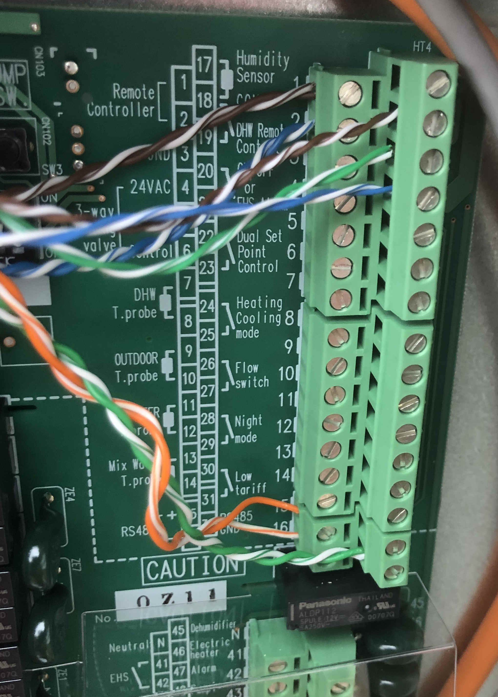
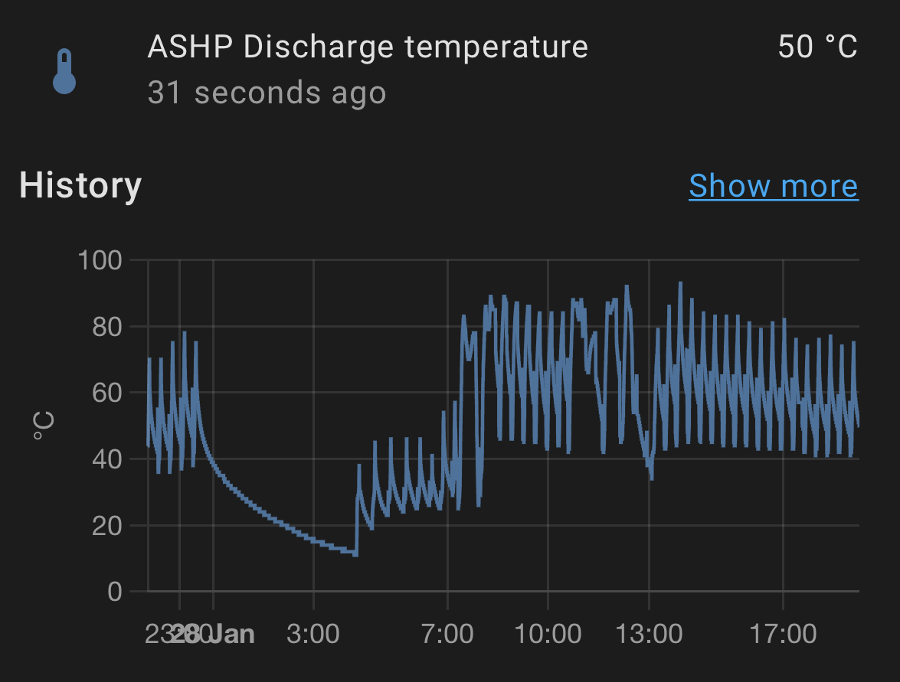

Modbus connection for Chofu / Grant Aerona3 air source heat pumps
=================================================================

This repository describes how to interface with the Modbus connection on
Chofu heat pumps, also marketed as the Grant Aerona3.

Thanks to guesswork and reverse engineering, tables of Modbus parameters are
provided.  We have successfully interfaced them to Home Assistant.

Guide
=====

Shopping list
-------------

 * A 3-core cable to connect to your outdoor heat pump unit, ideally
   screened.  Our example installation had an existing shielded F/UTP cat5e cable for
   connecting the relay inputs, with two unused pairs, so those were used.

 * A Modbus interface.  This can be either serial (RS485)-based or
   network-based.  Modbus offers standard protocols for Modbus-RTU (serial)
   and Modbus-TCP (network) so in theory any interface supporting these
   should work.

   This has been confirmed working with a [Hjelmslund
   USB485-MB45](https://hjelmslund.eu/) isolated USB-RS485 converter:
   
   and a [USR-W610 Wi-Fi/Ethernet to Modbus adapter](https://www.amazon.co.uk/gp/product/B07DNWM62H/):
   
   but these are the interfaces we had available, rather than specific
   recommendations.  USB RS485 interfaces are available for a few pounds/euro/dollars on
   eBay and will probably work - we would recommend isolated interfaces,
   especially if you have multiple phases available and your heat pump may
   be on a different phase to your computer.

 * A suitable termination for you're adapter's RS485 interface.  If it
   terminates in an RJ45 plug, that could be a
   network wall box and RJ45 front plate.  If your adapter terminates in screw
   terminals, you may not need additional hardware.

 * A computer on which to run Home Assistant, or an existing HA setup. 
   Follow the [Home Assistant](https://www.home-assistant.io/) Getting
   Started and other guides, which describe the hardware you need.  We used a Raspberry
   Pi 3.  From here on we'll assume you have Home Assistant installed and
   basic configuration done.


Connections
-----------

1. Remove the side panel of your outdoor heat pump unit to reveal the interface PCB:

   

   Note the three pins at the bottom of the main connection block:
   
   * 15: RS485 + (lower level)
   * 16: RS485 - (lower level)
   * 32: RS485 GND (upper level)

   You need to attach wires to these three terminals.  GND should go to your
   cable screen.

   

   In this case:

   * RS485 + = orange
   * RS485 - = orange/white
   * GND = green+green/white (the F/UTP shield had been clipped back so was unavailable)

2. Run these wires to where you want to mount your USB-RS485 or network-modbus
   adapter.  Here they were in our indoor utility cupboard, a cable run of
   about 7m.

3. If using an RJ45 adapter, there is a standard pinout.  From the [Modbus
   serial line specification](https://www.modbus.org/docs/Modbus_over_serial_line_V1_02.pdf):

   

   these are connected as follows:

   | ASHP            | RJ45 pin    | Modbus signal |
   |-----------------|-------------|---------------|
   | RS485+ (orange) | 5           | D0            |
   | RS485- (org/wh) | 4           | D1            |
   | GND             | 8           | GND           |

4. Service mode on the heat pump (see the [service manual](https://github.com/aerona-chofu-ashp/docs/blob/main/Chofu/R32/SERVICE%20MANUAL_AEYC-xx42%2C-xx43XU-GR%20%28RA-98%285%29%29.pdf) )
   has a series of parameters for configuring Modbus:

   

   It is probably fine to leave these as-is, just to remember the connection 
   has Modbus enabled by default,
   uses address 1, with 19200 bps, no parity and two stop bits.  If using a
   Modbus-TCP device you will likely need to configure it appropriately.

Test your connections
---------------------

5. Once connected, a simple way to test is via the [mbpoll
   tool](https://github.com/epsilonrt/mbpoll).
   With it we
   can read some temperatures out of the heat pump using a Modbus-RTU serial
   device on /dev/ttyUSB0:

```
$ mbpoll /dev/ttyUSB0 -b 19200 -d8 -s2 -Pnone -0 -r0 -c10 -t3
mbpoll 1.4-25 - FieldTalk(tm) Modbus(R) Master Simulator
Copyright © 2015-2019 Pascal JEAN, https://github.com/epsilonrt/mbpoll
This program comes with ABSOLUTELY NO WARRANTY.
This is free software, and you are welcome to redistribute it
under certain conditions; type 'mbpoll -w' for details.

Protocol configuration: Modbus RTU
Slave configuration...: address = [1]
                        start reference = 0, count = 10
Communication.........: /dev/ttyUSB0,      19200-8N2 
                        t/o 1.00 s, poll rate 1000 ms
Data type.............: 16-bit register, input register table

-- Polling slave 1... Ctrl-C to stop)
[0]: 	38
[1]: 	0
[2]: 	56
[3]: 	0
[4]: 	0
[5]: 	8
[6]: 	7
[7]: 	0
[8]: 	14
[9]: 	39
```

   For a network device, the syntax is:
```
$ mbpoll <hostname> -0 -r0 -c10 -t3
```
   If this doesn't work, check your wiring and settings.


Home Assistant
--------------

Home Assistant has its own Modbus implementation, so we simply need to add
to the HA `configuration.yaml` file (there is no configuration GUI).

6. If you don't know how to edit your configuration.yaml, we suggest
   installing the File Editor addon via Supervisor, enabling the 'Show in
   sidebar' toggle.  You can then find the File Editor in your HA sidebar,
   select it, and choose configuration.yaml.

7. Copy and paste our [configuration.yaml fragment](home-assistant/configuration.yaml)
   and add it to the end of your file.  Edit the connection settings at the 
   top of your `modbus:` section.  Save the file.
   
   If using an ethernet gateway, you can use the following [configuration.yaml fragment](home-assistant/configuration-modbus-tcp-rtuovertcp-gateway.yaml) 

8. In Configuration -> Settings click 'Check configuration', to ensure there
   are no syntax errors.  If all is good you can 'Restart' your Home
   Assistant.

9. Various `ASHP ...` readings should now show in 'Entities', and in the
   Sensors box on the front page, if using the default panel.

10. If you click on a reading, a graph of the reading will be shown.  You
   can also access graphs via the History page, like any other Home Assistant
   data.
   

Further reading
---------------

* [Protocol of Modbus over TCP](http://www.simplymodbus.ca/TCP.htm)
* [Modbus TCP client example](https://github.com/aldas/modbus-tcp-client/blob/master/examples/rtu.php) - in PHP
